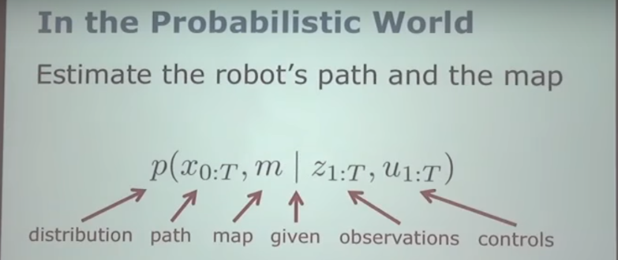
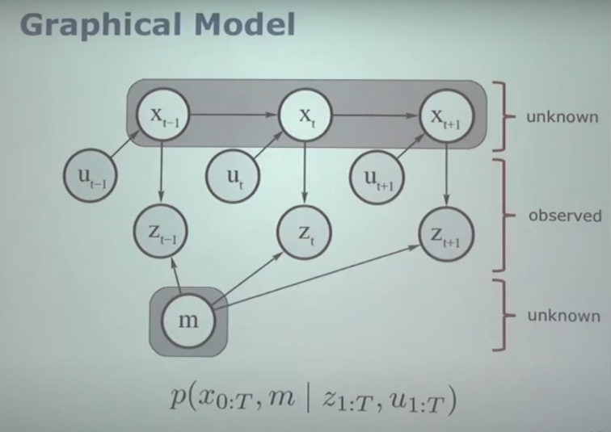
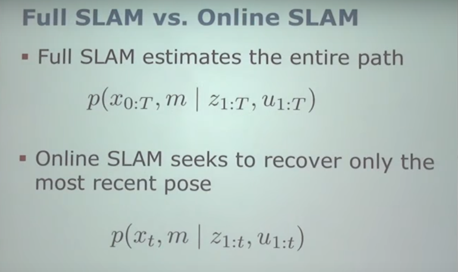
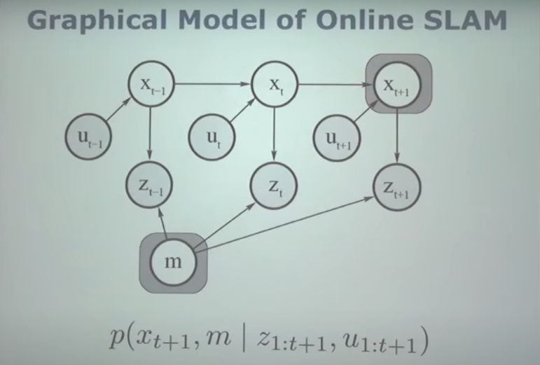
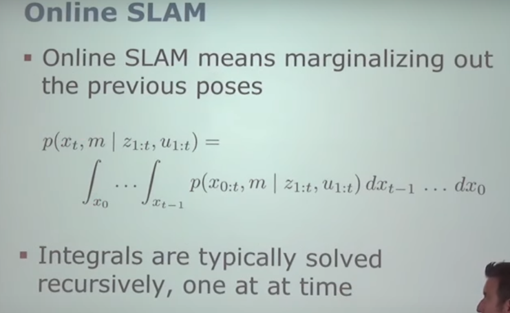

# In the Probabilistic world
Estimate the robot's path and the map

## p(x0:T, m | z1:T, u1:T)  -->slam的核心公式

- p: probability distribution
- x: path
- m: map
- |: given
- z: observations
- u: control commands or odometry information

fig.1

The whole thing we're going to do in the course is just how can we acturally estimae the probability distribution.

## Graphical Model

fig.2

如上图：
- an error means it influences
- for example: if I interested in estimating current pose $X_t$ of the robot, I look to the variable $X_{t-1}$ that is position at the previous point in time. and there's an error from $X_{t-1}$ to $X_t$ and **I can read that as $X_{t-1}$ influences $X_t$**
- we call it full slam, estimate the full trajectory of robot

## Full Slam vs. Online SLAM

- notice online slam variable is small $t$

## Graphical Model of Online SLAM

- you want to estimate is only these the last pose
- the previous pose are not interesting for me anymore
- From mathematical point of view this means we need to integral out all the previous poses(Rotation x0,x1,x2...x_{t-1})

## Online SLAM

## Why is SLAM a Hard Problem
- Robot path and map are both unknown.
- Map and pose estimates correlated.
- Picking wrong data associations can have catastrophic consequences(divergence).

## Taxonomy of SLAM Problem
- Volumetric vs. feature-based SLAM
- Topologic vs. geometric maps
- known vs. unknown correspondence
- static vs. dynamic environments
- Active vs. passive SLAM
- - passive SLAM: we assume the robot is controlled by someone else,by some person,by some algorithm...we don't care.
- - active SLAM: make its own decisions of where to go.
- Any-time vs. any-space SLAM (类似算法的时间复杂度，空间复杂度).
- Single robot vs. multi-robot SLAM.

## Three Main Paradigms
- Kalman filter
- particle filter
- Graph-based

