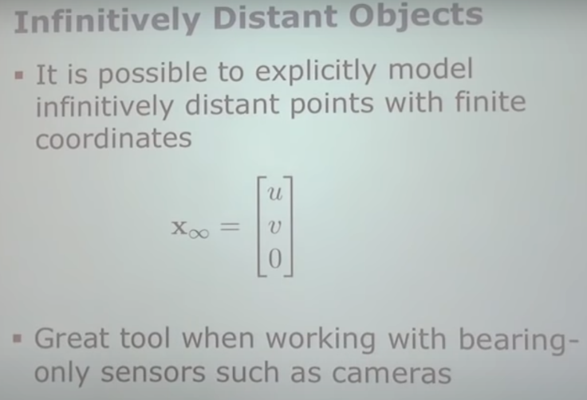

# A Short Introduction to Homogeneous coordinates

## Two Advantages
- we can represent infinity points
- a single matrix can represent roatation,translation,scale,sheer...

## Definition

## From Homogeneous to Euclidian Coordinates

---

- visualization

---
- represent infinity points

## Transformation

---
- translation of transformation

---

- rotation of transformation

---

- recap rotation matrix

---

- rotation and translation in T

--- 

- Similarity and Affine Transformations

## Transformations in 2D

## Transformations in Detail

## Conclusion

