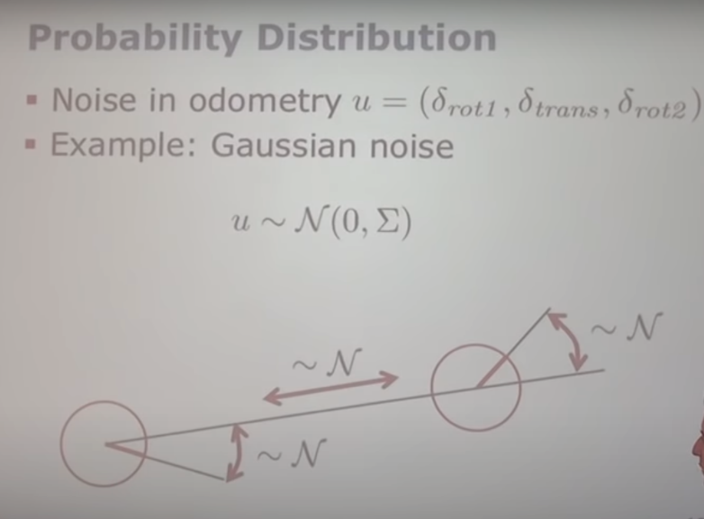

# A Short Introduction to the Bayes Filter and Related Models

## State Estimate
- estimate the state x of a system given observations z and controls u.
- Goal:  p(x | z, u)
- **bayes filter is one technique to do state estimate**

## Recursive Bayes Filter 1
- $bel(x_t) = p(x_t | z_1:t, u_1:t)$

Definition of the belief

## Recursive Bayes Filter 2
- $bel(x_t) = p(x_t | z_1:t, u_1:t)$
- = $\eta . p(z_t | x_t, z_{1:t-1}, u_{1:t}).p(x_t | z_{1:t-1}, u_{1:t})$

Bayes' rule

## Recursive Bayes Filter 3
- $bel(x_t) = p(x_t | z_1:t, u_1:t)$
- = $\eta . p(z_t | x_t, z_{1:t-1}, u_{1:t}).p(x_t | z_{1:t-1}, u_{1:t})$
- = $\eta . p(z_t | x_t).p(x_t | z_{1:t-1}, u_{1:t})$

Markov assumption

## Recursive Bayes Filter 4

Law of total probability

## Recursive Bayes Filter 5

## Recursive Bayes Filter 6

## Recursive Bayes Filter 7

## Motion and Obseration Model

- Prediction and Correction Step

- Motion and Obseration Model

## Different Realizations

## In This Course

# Motion Model

-
-

## Robot Motion Models

- Robot motion is inherently uncertain
- How can we model this uncertainty?

## Probabilistic Motion Models
- Specifies a posterior probability that action u carries the robot form x to x'

$$
p(x_t | u_t, x_{t-1})
$$

## Typical Motion Model
-

### Odometry Model
- 

- 

### Velocity Model
- $u = (u,w)^T$
- translational velocity
- rotational velocity

- - w 不等于0
- - 可以在很小的时间间隔内看作是圆形运动

### Probability Distribution
- 

- 

different noise parameters get different distributions

#### Problem of the Velocity-Based Model
- Robot moves on a circle.
- The circle constrains the final orientation.
- Fix: introduce an additional noise term on the oritentation.

# Sensor Model
- 

## Model for Laser Scanners
- 

## Beam-Endpoint Model
- 

## Ray-Cast Model

- exponential decay(指数衰减) : allow us to cover dynamtic obstacles

## Model for Perceiving Landmarkers with Range-Bearing Sensors
- $Q_t $ 是噪声项

# Summary
- 

# Recursive Bayes Filter 1-7 **参考**

- 回顾贝叶斯公式：
- 1. $p(A | B) = \frac{p(AB)}{p(B)}$
- 2. $p(B | A) = \frac{p(AB)}{p(A)}$
- 整合1,2方程式，得到贝叶斯定理：$p(A | B) = \frac{p(B| A)}{p(B)}$

### 置信度(belief)

- $bel(x_t) = p(x_t | z_1:t, u_1:t)$

利用贝叶斯公式：

 $bel(x_t) = p(x_t | z_{1:t}, u_{1:t})$

= $\eta . p(z_t | x_t, z_{1:t-1}, u_{1:t}).p(x_t | z_{1:t-1}, u_{1:t})$

- 其中，$\eta 是归一化项(normalizing term)$

### 马尔可夫假设
- 为了简化问题，假设状态转移模型和传感器观察模型t时刻的状态都只与t-1时刻的状态有关，而与之前所有时刻的状态无关。

$bel(x_t) = p(x_t | z_{1:t}, u_{1:t})$

= $\eta . p(z_t | x_t, z_{1:t-1}, u_{1:t}).p(x_t | z_{1:t-1}, u_{1:t})$

**简化为：**
$bel(x_t) = p(x_t | z_t)$

= $\eta . p(z_t | x_t).p(x_t | z_{1:t-1}, u_{1:t})$