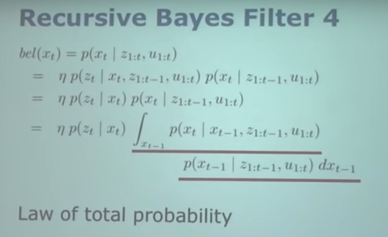

# A Short Introduction to the Bayes Filter and Related Models

## State Estimate
- estimate the state x of a system given observations z and controls u.
- Goal:  p(x | z, u)
- **bayes filter is one technique to do state estimate**

## Recursive Bayes Filter 1
- $bel(x_t) = p(x_t | z_1:t, u_1:t)$

Definition of the belief

## Recursive Bayes Filter 2
- $bel(x_t) = p(x_t | z_1:t, u_1:t)$
- = $\eta . p(z_t | x_t, z_{1:t-1}, u_{1:t}).p(x_t | z_{1:t-1}, u_{1:t})$

Bayes' rule

## Recursive Bayes Filter 3
- $bel(x_t) = p(x_t | z_1:t, u_1:t)$
- = $\eta . p(z_t | x_t, z_{1:t-1}, u_{1:t}).p(x_t | z_{1:t-1}, u_{1:t})$
- = $\eta . p(z_t | x_t).p(x_t | z_{1:t-1}, u_{1:t})$

Markov assumption

## Recursive Bayes Filter 4

Law of total probability

## Recursive Bayes Filter 1,2,3,4 **参考**

- 回顾贝叶斯公式：
- 1. $p(A | B) = \frac{p(AB)}{p(B)}$
- 2. $p(B | A) = \frac{p(AB)}{p(A)}$
- 整合1,2方程式，得到贝叶斯定理：$p(A | B) = \frac{p(B| A)}{p(B)}$

### 置信度(belief)

- $bel(x_t) = p(x_t | z_1:t, u_1:t)$

利用贝叶斯公式：

 $bel(x_t) = p(x_t | z_{1:t}, u_{1:t})$

= $\eta . p(z_t | x_t, z_{1:t-1}, u_{1:t}).p(x_t | z_{1:t-1}, u_{1:t})$

- 其中，$\eta 是归一化项(normalizing term)$

### 马尔可夫假设
- 为了简化问题，假设状态转移模型和传感器观察模型t时刻的状态都只与t-1时刻的状态有关，而与之前所有时刻的状态无关。

$bel(x_t) = p(x_t | z_{1:t}, u_{1:t})$

= $\eta . p(z_t | x_t, z_{1:t-1}, u_{1:t}).p(x_t | z_{1:t-1}, u_{1:t})$

**简化为：**
$bel(x_t) = p(x_t | z_t)$

= $\eta . p(z_t | x_t).p(x_t | z_{1:t-1}, u_{1:t})$